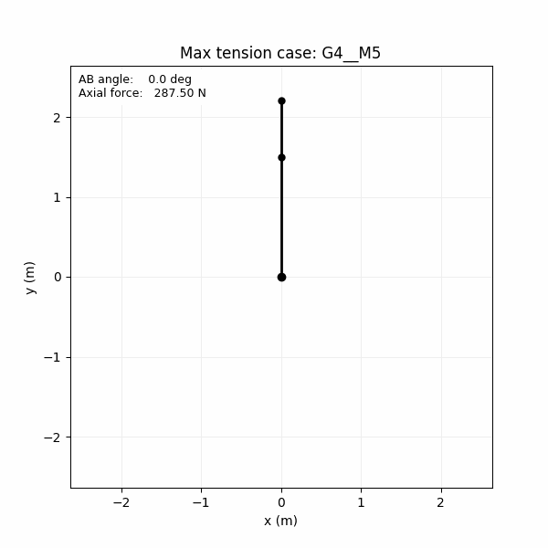
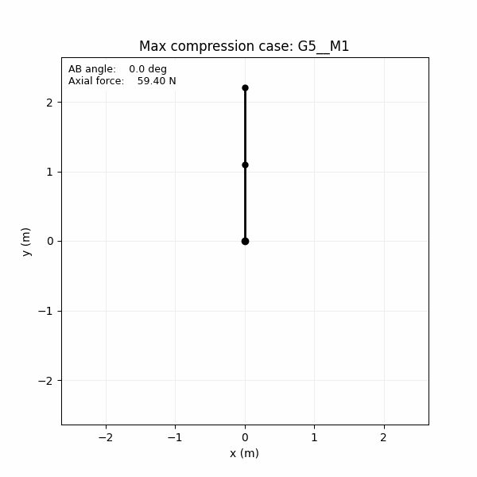

# Amertat Short Technical Assignment

This repository simulates a planar two-link rotating mechanism and computes the signed axial force in link `AB` for all geometry-motion combinations.

## What is included
- `run_assignment.py`: entry-point script.
- `src/mechanism_assignment.py`: kinematics, dynamics, plotting, animation, and reporting.
- `scenarios.json`: example input with 5 geometry and 5 motion sets (25 combinations).
- `MODEL_APPROACH.md`: concise derivation and sign convention.

## Setup
```bash
python -m pip install -r requirements.txt
```

## Run
```bash
python run_assignment.py --scenarios scenarios.json --output-dir output --steps 721
```

Flags:
- `--scenarios`: path to the JSON input file that defines geometry and motion scenarios. Default: `scenarios.json`
- `--output-dir`: directory where plots, CSV, insight report, and animations are written. Default: `output`
- `--steps`: number of simulation samples over one full `AB` rotation (`0-360 deg`). Default: `721`

## Generated outputs
- `output/plots/*.png`: one line plot per combination.
- `output/all_combinations_grid.png`: comparison grid for all combinations.
- `output/summary_metrics.csv`: max tension/compression per combination.
- `output/engineering_insight.md`: extreme cases and primary parameter driver.
- `output/animations/*.gif`: mechanism animation for extreme case(s).

## 25 Case Summary Table
The table below summarizes all `5 x 5 = 25` geometry-motion combinations using the generated metrics.

| Case | G Values (`L_AB` m, `L_BC` m, `M_b` kg, `M_c` kg) | M Values (`omega_AB` rad/s, `omega_BC,cw` rad/s) | Max Tension (N) | Angle at Max Tension (deg) | Max Compression (N) | Angle at Max Compression (deg) | Explanation |
| --- | --- | --- | ---: | ---: | ---: | ---: | --- |
| `G1__M1` | `1.0, 0.6, 3.0, 1.0` | `2.0, 4.0` | 25.60 | 0.0 | 6.40 | 180.0 | Low-speed baseline for G1; forces stay tensile over full rotation. |
| `G1__M2` | `1.0, 0.6, 3.0, 1.0` | `3.0, 2.0` | 38.40 | 0.0 | 33.60 | 108.0 | Higher AB speed lifts the full curve; no compressive region appears. |
| `G1__M3` | `1.0, 0.6, 3.0, 1.0` | `4.0, 4.0` | 73.60 | 0.0 | 54.40 | 90.0 | Increased AB and BC speeds amplify inertia and raise peak tension. |
| `G1__M4` | `1.0, 0.6, 3.0, 1.0` | `5.0, 3.0` | 105.40 | 0.0 | 94.60 | 112.5 | Fast AB rotation dominates, creating high tensile loading throughout. |
| `G1__M5` | `1.0, 0.6, 3.0, 1.0` | `6.0, 5.0` | 159.00 | 0.0 | 129.00 | 294.5 | Highest-speed G1 case with strong tensile-dominant behavior. |
| `G2__M1` | `1.2, 0.8, 3.0, 1.2` | `2.0, 4.0` | 35.52 | 240.0 | 4.80 | 180.0 | Larger geometry/mass than G1 increases loads; minimum is near zero tension. |
| `G2__M2` | `1.2, 0.8, 3.0, 1.2` | `3.0, 2.0` | 49.20 | 0.0 | 41.52 | 324.0 | Moderate-speed case stays tensile with elevated force floor. |
| `G2__M3` | `1.2, 0.8, 3.0, 1.2` | `4.0, 4.0` | 96.00 | 0.0 | 65.28 | 90.0 | Higher speeds significantly increase both peak and minimum tensile levels. |
| `G2__M4` | `1.2, 0.8, 3.0, 1.2` | `5.0, 3.0` | 134.64 | 0.0 | 117.36 | 337.5 | AB-speed-driven inertia raises loads while preserving positive axial force. |
| `G2__M5` | `1.2, 0.8, 3.0, 1.2` | `6.0, 5.0` | 205.44 | 0.0 | 157.44 | 294.5 | High speed plus larger geometry yields very high tensile response. |
| `G3__M1` | `0.9, 1.0, 2.5, 1.5` | `2.0, 4.0` | 38.40 | 0.0 | -9.60 | 60.0 | First true compression case; BC contribution overcomes AB tension locally. |
| `G3__M2` | `0.9, 1.0, 2.5, 1.5` | `3.0, 2.0` | 38.40 | 0.0 | 26.40 | 108.0 | Slightly faster AB removes negative compression and restores all-tension behavior. |
| `G3__M3` | `0.9, 1.0, 2.5, 1.5` | `4.0, 4.0` | 81.60 | 0.0 | 33.60 | 90.0 | Speed increase grows tensile peaks while keeping minima positive. |
| `G3__M4` | `0.9, 1.0, 2.5, 1.5` | `5.0, 3.0` | 103.50 | 0.0 | 76.50 | 337.5 | High AB speed shifts minimum later in cycle and raises overall load level. |
| `G3__M5` | `0.9, 1.0, 2.5, 1.5` | `6.0, 5.0` | 167.10 | 0.0 | 92.10 | 294.5 | Very high-speed case with large inertia-driven tensile force. |
| `G4__M1` | `1.5, 0.7, 4.0, 1.0` | `2.0, 4.0` | 41.20 | 240.0 | 18.80 | 180.0 | Long AB and heavier B mass increase baseline tensile demand. |
| `G4__M2` | `1.5, 0.7, 4.0, 1.0` | `3.0, 2.0` | 70.30 | 0.0 | 64.70 | 108.0 | Speed increase raises both peak and minimum axial force substantially. |
| `G4__M3` | `1.5, 0.7, 4.0, 1.0` | `4.0, 4.0` | 131.20 | 0.0 | 108.80 | 90.0 | Strong tensile-dominant response from geometry and motion together. |
| `G4__M4` | `1.5, 0.7, 4.0, 1.0` | `5.0, 3.0` | 193.80 | 0.0 | 181.20 | 112.5 | Near-extreme loading where AB inertial term is strongly dominant. |
| `G4__M5` | `1.5, 0.7, 4.0, 1.0` | `6.0, 5.0` | 287.50 | 0.0 | 252.50 | 294.5 | Global maximum tension case across all 25 combinations. |
| `G5__M1` | `1.1, 1.1, 3.5, 2.0` | `2.0, 4.0` | 59.40 | 0.0 | -11.00 | 180.0 | Global maximum compression case at low speed due to distal mass effects. |
| `G5__M2` | `1.1, 1.1, 3.5, 2.0` | `3.0, 2.0` | 63.25 | 0.0 | 45.65 | 108.0 | Increased AB speed removes negative compression and raises load floor. |
| `G5__M3` | `1.1, 1.1, 3.5, 2.0` | `4.0, 4.0` | 132.00 | 0.0 | 61.60 | 90.0 | Higher-speed regime with much larger tension peaks. |
| `G5__M4` | `1.1, 1.1, 3.5, 2.0` | `5.0, 3.0` | 171.05 | 225.0 | 131.45 | 337.5 | High-speed case with phase-shifted peak angle and fully tensile cycle. |
| `G5__M5` | `1.1, 1.1, 3.5, 2.0` | `6.0, 5.0` | 272.80 | 0.0 | 162.80 | 294.5 | One of the highest tensile cases, dominated by speed-induced inertia. |

## Animation Cases (2 GIF Files)
These two animations highlight the global extreme combinations.

| GIF File | Case | What It Shows | Why It Matters |
| --- | --- | --- | --- |
| `output/animations/G4__M5_max_tension.gif` | `G4__M5` | Motion of AB-BC at the highest tensile-load combination. | Confirms the worst tensile demand and the phase where AB carries the largest pull. |
| `output/animations/G5__M1_max_compression.gif` | `G5__M1` | Motion of AB-BC at the highest compressive-load combination. | Shows the condition where axial force in AB becomes most negative (compression). |




## Notes
- Units expected in `scenarios.json`: meters, kilograms, radians/second.
- `omega_bc_clockwise_rad_s` is a positive magnitude, internally applied as clockwise rotation.
